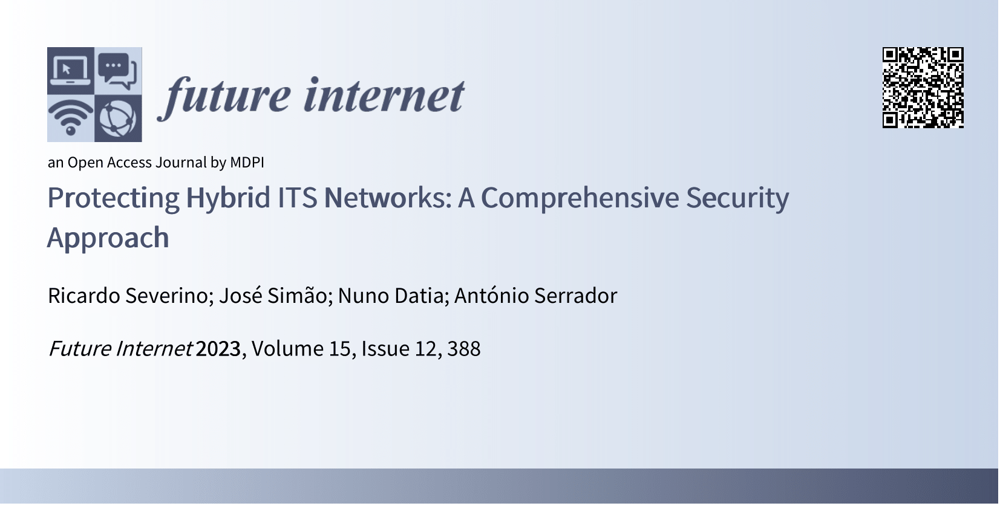

# Security in Hybrid ITS Networks

Repository for the code developed in the context of my thesis entitled "Security in Hybrid ITS Networks" for the master's degree in Computer Science and Engineering at Instituto Superior de Engenharia de Lisboa (ISEL). This thesis was developed with the guidance of professors José Simão and Nuno Datia.

### Table of contents
- [Documents](#documents)
- [Addressed Problem](#addressed-problem)
- [Proposed Approach](#proposed-approach)

## Documents

The dissertation is available [here](https://github.com/RicardoFilipe99/Security-in-Hybrid-ITS-Networks/blob/main/docs).

We had the opportunity to disclose part of the work developed and results obtained in the context of this thesis, in the following [paper](https://doi.org/10.3390/fi15120388):

    

## Addressed Problem

Cooperative Intelligent Transport Systems (C-ITS) continue to be developed to enhance transportation safety and sustainability. However, the communication of Vehicle-to-Everything (V2X) systems is inherently open, leading to vulnerabilities that attackers can exploit. This represents a threat to all road users, as security failures can lead to privacy violations or even fatalities. Moreover, a high fatality rate is correlated with soft-mobility road users. Therefore, when developing C-ITS systems, it is important to broaden the focus beyond connected vehicles to include soft-mobility users and legacy vehicles.

## Proposed Approach

This thesis presents a new approach developed in the context of emerging hybrid networks, combining Intelligent Transport Systems operating in 5.9 GHz (ITS-G5) and radio mobile cellular technologies. Two protocols were implemented and evaluated to introduce security guarantees (such as privacy and integrity) in communications within the developed C-ITS hybrid environment. As a result, this work securely integrates G5-connected ITS stations and soft-mobility users through a smartphone application via cellular networks. Commercial equipment was used for this goal, including on-board and roadside units.

    

