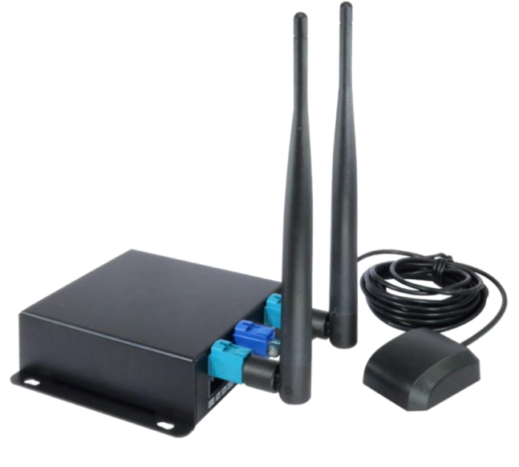

## On-board unit (OSU) application

The OBU equipment used was the Unex EVK-301E. These are present in vehicles.

    

Its application was developed in the C programming language using the V2Xcast Software Development Kit (SDK) available for the Unex OBU. The application has two main services that are responsible for transmitting locally generated and receiving messages from the G5 network.