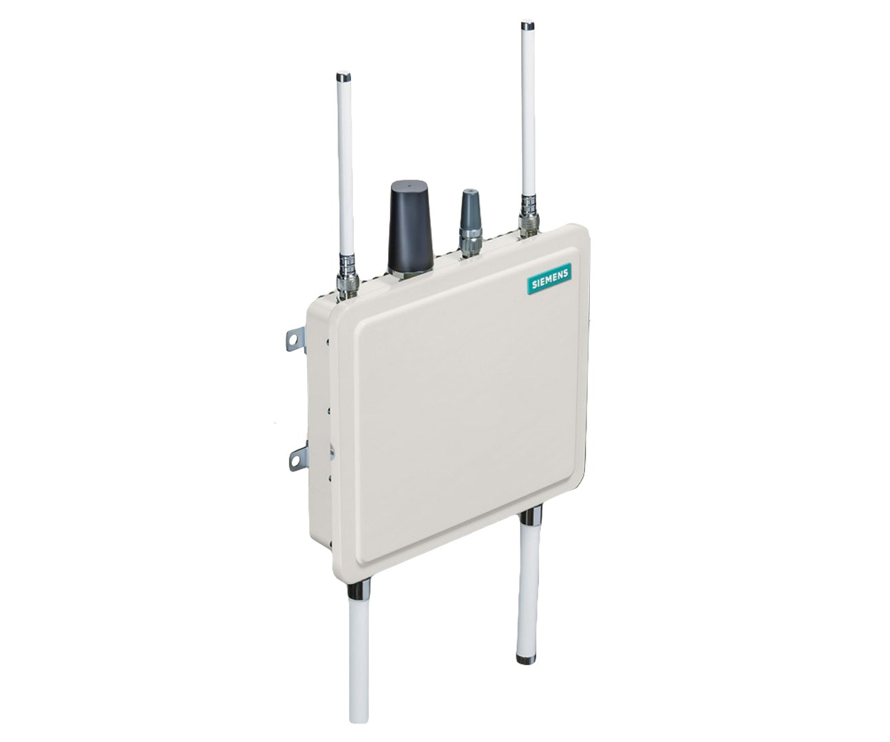

# Code for Security in Hybrid ITS Networks 

Main code developed in the context of my thesis.

### Table of contents
- [Android application](#android-app)
- [Middleware Roadside unit (RSU) application](#rsu-app)
- [On-board unit (OSU) application](#obu-app)
- [Message Generator](#message-generator)

## Android application
The smartphone application was implemented as an Android app using the Java Cryptography Architecture (JCA) as the cryptographic library. It primarily focuses on two services: transmitting locally generated messages and receiving messages from the broker.

This application was developed taking into account the needs of more vulnerable modes of transportation, like the needs of soft-mobility. Thus, integrating them in a C-ITS hybrid environment through a smartphone application via cellular networks. It can be configured with three different security approaches.

## Roadside unit (RSU) application

The RSU equipment used was the Siemens ESCoS RSU. RSUs are present in road infrastructure, connecting it to the G5 network. 

    

The RSUs have direct communication with the ITS-Centre, thus being the connection point between the cellular and G5 network. 

## On-board unit (OSU) application

The OBU equipment used was the Unex EVK-301E. These are present in vehicles and other ITS-stations.

    

Its application was developed in the C programming language using the V2Xcast Software Development Kit (SDK) available for the Unex OBU and has two main services. These are responsible for transmitting locally generated and receiving messages from the G5 network.

## Message Generator

Application for system evaluation purposes where it is possible to generate and send messages, simulating a network and computational overload. It allows to configure the number of stations to be simulated and the frequency at which they are sending messages. These messages can use one of three security approaches. Application not fully developed.